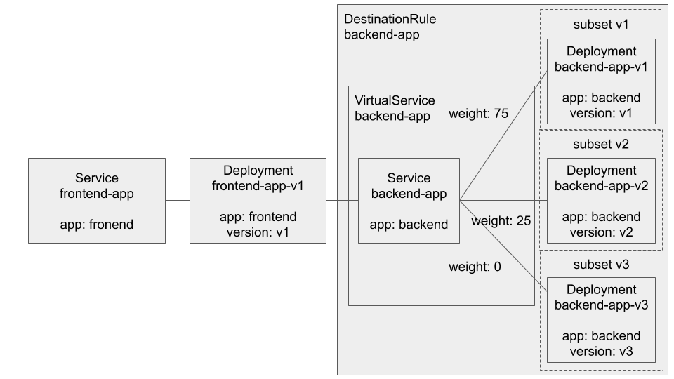

= istio-sample

Spring Bootアプリケーションを使って、IstioのTraffice Managementを試すサンプル。 +
全体概要は下図の通り。 +
frontend-app、backend-appをそれぞれSpring Bootで実装している。

== frontend-app

backend-appからメッセージを取得し、自身のバージョン・自身のメッセージ・backend-appからのメッセージを返すアプリケーション。　+
自身のバージョン・backend-appのURLは `src/main/resources/application.yml` または環境変数で設定可能。 +
application.ymlを使用する場合は以下のように設定する。

[source, yaml]
----
app:
  version: v1
  url: http://localhost:8081
----

環境変数で指定する場合、以下のように環境変数を設定した上でアプリケーションを起動する。

[source, shellscript]
----
export APP_VERSION=v1
export APP_URL=http://localhost:8081
----

== backend-app

自身のバージョン・自身のメッセージを返すアプリケーション。 +
自身のバージョンは `src/main/resources/application.yml` または環境変数で設定可能。 +
application.ymlを使用する場合は以下のように設定する。

[source, yaml]
----
app:
  version: v1
----

環境変数で指定する場合、以下のように環境変数を設定した上でアプリケーションを起動する。

[source, shellscript]
----
export APP_VERSION=v1
----
